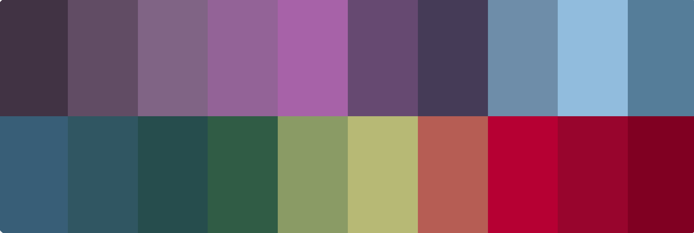

# Building the tag color palette

I went to [colorkit.co](https://colorkit.co/) and grabbed [this palette](https://colorkit.co/palette/413344-614c65-806485-936397-a662a8-664972-463c57-6e8da9-91bcdd-567d99-395e77-305662-264d4d-315c45-8a9a65-b6b975-b65d54-b60033-98062d-800022/) which contains these colors


I was also able to download the hex codes
```python
COLORS = ["#413344","#614c65","#806485","#936397","#a662a8","#664972","#463c57","#6e8da9","#91bcdd","#567d99",
            "#395e77","#305662","#264d4d","#315c45","#8a9a65","#b6b975","#b65d54","#b60033","#98062d","#800022"]
```

That was good, but I noticed that the palette display included a contrasting color, so I built the list of 20 colors with their contrasting colors as [displayed on the site](https://colorkit.co/palette/413344-614c65-806485-936397-a662a8-664972-463c57-6e8da9-91bcdd-567d99-395e77-305662-264d4d-315c45-8a9a65-b6b975-b65d54-b60033-98062d-800022/).

```python
COLORS = [ 
  {"color": "#413344", "contrast_color": "#bdbbbd"}, {"color": "#614c65", "contrast_color": "#bebabf"},
  {"color": "#806485", "contrast_color": "#f6e3f9"}, {"color": "#936397", "contrast_color": "#ffebff"},
  {"color": "#a662a8", "contrast_color": "#fff4ff"}, {"color": "#664972", "contrast_color": "#c1b9c4"},
  {"color": "#463c57", "contrast_color": "#bdbbc0"}, {"color": "#6e8da9", "contrast_color": "#ffffff"},
  {"color": "#91bcdd", "contrast_color": "#445a6b"}, {"color": "#567d99", "contrast_color": "#f1ffff"},
  {"color": "#395e77", "contrast_color": "#adbfce"}, {"color": "#305662", "contrast_color": "#b7bcbe"},
  {"color": "#264d4d", "contrast_color": "#b8bdbc"}, {"color": "#315c45", "contrast_color": "#b4beb8"},
  {"color": "#8a9a65", "contrast_color": "#ffffff"}, {"color": "#b6b975", "contrast_color": "#57592c"},
  {"color": "#b65d54", "contrast_color": "#ffebdf"}, {"color": "#b60033", "contrast_color": "#e1afb7"},
  {"color": "#98062d", "contrast_color": "#d8b2b8"}, {"color": "#800022", "contrast_color": "#d3b4b9"}
]
```

That was good, but I wanted to include a descriptive name for each color.  Since I had the codes, I was able to call the [Color API](https://www.thecolorapi.com/) to look up a reasonable color name based on the hex code.  I used [this program](../../../.build/generate_palette.py) to do it and this is the result.

```python
COLORS = [
  {"color": "#413344", "contrast_color": "#bdbbbd", "name": "blackcurrant"},
  {"color": "#614c65", "contrast_color": "#bebabf", "name": "salt-box"},
  {"color": "#806485", "contrast_color": "#f6e3f9", "name": "rum"},
  {"color": "#936397", "contrast_color": "#ffebff", "name": "trendy-pink"},
  {"color": "#a662a8", "contrast_color": "#fff4ff", "name": "violet-purple"},
  {"color": "#664972", "contrast_color": "#c1b9c4", "name": "cyber-grape"},
  {"color": "#463c57", "contrast_color": "#bdbbc0", "name": "mulled-wine"},
  {"color": "#6e8da9", "contrast_color": "#ffffff", "name": "bermuda-gray"},
  {"color": "#91bcdd", "contrast_color": "#445a6b", "name": "morning-glory"},
  {"color": "#567d99", "contrast_color": "#f1ffff", "name": "horizon"},
  {"color": "#395e77", "contrast_color": "#adbfce", "name": "william"},
  {"color": "#305662", "contrast_color": "#b7bcbe", "name": "casal"},
  {"color": "#264d4d", "contrast_color": "#b8bdbc", "name": "plantation"},
  {"color": "#315c45", "contrast_color": "#b4beb8", "name": "stromboli"},
  {"color": "#8a9a65", "contrast_color": "#ffffff", "name": "avocado"},
  {"color": "#b6b975", "contrast_color": "#57592c", "name": "misty-moss"},
  {"color": "#b65d54", "contrast_color": "#ffebdf", "name": "giants-club"},
  {"color": "#b60033", "contrast_color": "#e1afb7", "name": "monza"},
  {"color": "#98062d", "contrast_color": "#d8b2b8", "name": "monarch"},
  {"color": "#800022", "contrast_color": "#d3b4b9", "name": "burgundy"}
]
```

I'm happy with those results and these are the 20 colors I'll use the tag pill-badge colors (and their contrasting text).  This list forms the starting point for the sccs file in this directory.