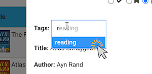
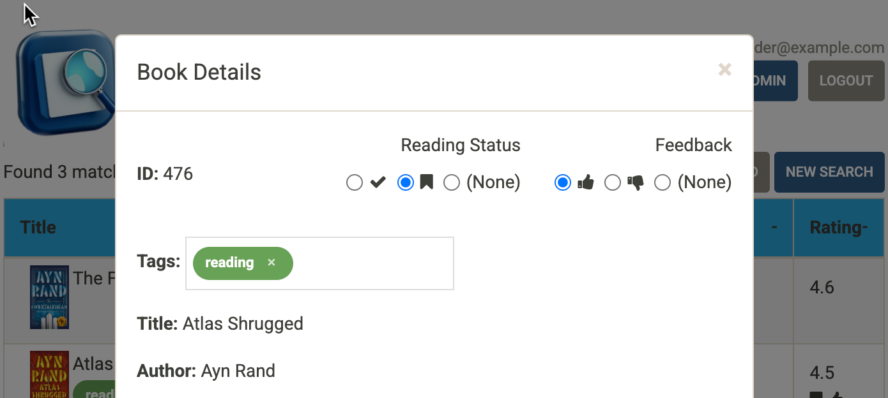
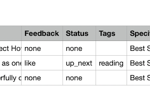

---
# Feel free to add content and custom Front Matter to this file.
# To modify the layout, see https://jekyllrb.com/docs/themes/#overriding-theme-defaults

title: User's Guide
nav_order: 2
---
# User's Guide
{: .no_toc }

<details open markdown="block">
  <summary>
    Table of contents
  </summary>
  {: .text-delta }
 - TOC
{:toc}
</details>  

The [booklist.media](https://booklist.media) site is designed to allow a user to keep track of books.  Books that have been read.  Books that you want to read.  Books that you've heard about but don't want to read.  There are some built-in quick tagging features (read, up-next, liked, disliked) and the ability to create your own unique set of tags that annotate the list of books displayed and can filter a search.  Most of the more interesting features of the site require a user to be logged in.  However, there are a few basic features that can be used anonymously.

## Anonymous Usage

Without logging in, you can 

* Search for books in the collection by author, title, or category
* Order the results of a search by column, either ascending or descending
* View details of a book from the search results display
* Download a CSV file of the books displayed in search results

### Searching Anonymously

#### Searching by Author or Title

When you first land at [booklist.media](https://booklist.media), you're at the search entry by author page


The case-insensitive search looks for the characters you type anywhere in the author's name.  For example, typing `rand` for the search argument finds 3 books.  Two by `Ayn Rand` and one by `Laura Hillenbrand`.


The results display includes a book cover image, the title, the author, and a rating from 1(worst) to 5(best).  The source for the ratings is an average of Amazon.com reviews for the title.   The cover image is also a hyperlink that will take you to the page on Amazon.com where you can purchase the book.

Searching by title works the same way.  Just click on the `Title` tab on the search entry page.


From there, you can type a title or partial title string to search.  For example, typing `war` and clicking the `Search` button or hitting enter will display a list of 56 books with that string in the title


#### Search by Category

In addition to title and author searches, you can search by category.  Each book is assigned to a category from the category tree.  By clicking on the "Category" tab, you can view the category tree and select categories to include in the search.  You can open branches of the tree by clicking on the `+` icons, and collapse a branch by clicking on `-`.  If you check the box for a parent, all their children are selected as well.  You can clear all the category selections by clicking on the `Clear Category Selections` button.

For example, if you wanted to find books in either the `Fiction > Action` or `Classics` categories, you would check both of those boxes, like so 


Clicking the `Search` button will show a result screen with books matching those category selections


### Ordering Search Results

Once a search result is displayed, you can order the matching books by title, author, or rating by simply clicking the corresponding heading on the search result page.  Clicking the heading again changes the direction of the sort between ascending and descending.  When a sort order has been selected, an up or down arrowhead is shown in that column.   For example, this shows that the previous title-based search has been sorted in ascending order by author.


### Viewing Details for a Book

Each book has more information than just what is shown in the search results.  If you click on a row in the results table (anywhere but on the book cover image), a pop-up with more details about that book will be shown


The details include a description, a larger cover image, catalog reference numbers, some specifications about the volume, and pre-filled hypertext links for search at some libraries to look for the book in the stacks.


### Downloading search results

From any search result page, you can click the `Download` button to download a CSV file of the displayed results.  The file is downloaded by your browser as `booklist.csv` and the contents will have the same ordering that is displayed when you clicked the button.  CSV files can be used and displayed by many programs, like [Apple Numbers](https://www.apple.com/in/numbers/)


## Logging into Booklist.media

So far, we've covered the things you can do on [booklist.media](https://booklist.media/) without logging into the site.  And, as useful as those things are, there are even more useful things you can do with the site once you're logged in!  But first, you might wonder, how do I create a login on the site?

### Create a userid on Booklist.media

You probably noticed the `Login` button in the upper right corner in the previous screenshots.  Clicking on that button takes you to the login page


If you had a userid and password for the site, this is where you'd enter them.  But, if you don't have one, you'll need to request one.  At the bottom right of the login screen you'll see a `Request userid` button.  Click on it to bring up a form where you can fill in the necessary information to request a userid


Since [booklist.media](https://booklist.media/) is a hobby site, the administrator chose not to have an open registration process.  Filling out the `Request userid` form and submitting it contacts the administrator, and the administrator will review your request and either grant it or deny it.  The process might take a day.  [booklist.media](https://booklist.media/) is not a huge commercial concern with a large dedicated customer service staff.  Please be patient.

Your userid will be your email address and it must be valid.  In order to ensure that the address is valid and owned by someone who wants to be using [booklist.media](https://booklist.media/), it must be confirmed.  When the administrator registers an email address, a Welcome email will be sent to that email address containing a confirmation link to be clicked. Be sure to check your spam folder.  When you click that link, you'll end up back at the login page, but a message will be displayed informing you that your userid (email address) has been confirmed.



If you ever need to have the confirmation link resent to you, you can click the `Confirm account` link on the login page, enter your email address, and the welcome email will be resent to you.

At this point, your email address is registered, and you should be good to go.  Oh wait!  You don't know your password.  That's intentional.  You need to reset your password by following the `Forgot Password` process, described next.

### Resetting your password

If you've forgotten your password, or if your userid is newly created, you'll have to reset your password.  Click the `Forgot Password` link on the login page to start the reset process.


Fill in your email address and click `Reset Password`.  This will cause an email to be sent to you with a reset password link.  When you click that link, you'll be sent to a page where you can change your password.


### Entering your userid and password

Once you've been registered and know your password, you can use it to authenticate to the [booklist.media](https://booklist.media/) on the Login page and start accessing the features available to logged-in users.

## Authenticated Search

As a logged-in user, you'll notice some differences in the search page. Aside from a `Logout` button, which will log you out, and an `Admin` button, which we'll cover later, you will see that tag, reading status, and feedback filter specifications that can be used to limit the search results.


Tags, status, and feedback are stored on a per-user basis and allow a user to adapt the inventory of books on the site with values for these attributes that suit their needs.   Using these search filters is straightforward, and with them, search works the same way as described above, except that the results are additionally limited to books with tags, status, and feedback attributes that match those set by the user. We'll come back to specifying filters on a search later.   First, we need to dive into how a user sets these attributes for a book.

### Setting user-level attributes for a book

The user-level attributes for a book are set on the book details display.  When a user is logged in, that display is altered to include controls for specifying tags, status, and feedback.  Let's return to our author search and with input `rand` and select `Atlas Shrugged` by clicking on that row in the search results.


You can see that the status and feedback areas have radio buttons and the buttons for `(None)` are selected.  We haven't set any status or feedback yet.  Likewise, there is a tag entry field that shows no tags.

#### Setting Reading Status

There are two icons for reading status, and you can make them mean whatever you like, but their intended meaning is

<i class="fa fa-check"></i> 
: _read_, as in "I've _read_ this book"

<i class="fa fa-bookmark"></i> 
: _up next_, as in "This is a book I'm planning to read soon"

You might decide that it makes more sense to treat <i class="fa fa-bookmark"></i> as meaning "I'm currently reading this book".  It's really up to you.

#### Setting Feedback

There are two icons for feedback, while you can use them however you like, their intended meaning is

<i class="fa fa-thumbs-up"></i>
: _like_, as in "I _like_ this book"

<i class="fa fa-thumbs-down"></i>
: _dislike_, as in "I _dislike_ this book"

#### Setting Tags

Reading status and feedback will cover many possible scenarios, but if you need finer-grained control over marking books, you can use user-level tags.  You create tags by typing their name, which should be short and descriptive (the limit is 32 characters).  For example, let's suppose you want to define a tag named `reading` to indicate that you are currently reading a book.  You type 'reading' in the tag entry box and hit `Enter`


A tag will be created and represented by a pill in the entry field with the tag name using a randomly chosen color.  Below, we'll cover how to change the color of a tag, but for now, let's just focus on adding tags to a book.  You'll also notice that there's a little `x` in the tag pill.  You can remove a tag from a box by clicking on that `x`. 

Once you have tags defined, you don't need to type the whole word, you can type just a character or two of the tag name and a selection list of matching tags is shown. You can select the tag from there.



#### Putting it together

Once you've set the attributes you want for a book, for example

you can dismiss the book details by clicking the `x` in the top-right corner of its modal dialog.  You'll notice that the row in the search results for the book you marked up has also been marked up now with the attributes you've set.


These attributes are also included in the CSV file you might download from any search result page.  `Feedback` and `Status` are separate columns that will have `like`/`dislike` or `read`/`up_next` as values if those attributes have been set.  `Tags` is another column that will have a comma-separated list of tag names set for the book.



### Specifying user-level attributes in search

Now that you've seen how attributes are set on books, let's return to the authenticated search entry page and those filters.  The radio-buttons for status and feedback are pretty self-explanatory.  Checking `(None)` for an option will only find those books that do not have that attribute set.  Tags filter input works a little differently.  If you click the edit pencil, <i class="fa fa-pencil"></i>, a pop-up showing all the tags you have defined will be shown.  Each tag will have a checkbox in its pill.  If you select a tag, it will be added to the search filter, and its pill will also show up on the search entry field


Specifying filters limits the results of the search.  The  `Feedback`, `Status`, and `Tags` filters are combined with `and` so that only books that match all of the filters are returned.  Specifying more than one tag defines a set of tags, and an `in` operator is used.  A book must match at least one of the tag names specified to match a tag filter.


## Managing your tags

We introduced tags above to allow for customized marking of books and showed how to create tags on the fly and specify them in a search filter.  The administration section of the site allows a user to manage their set of tags.  From a user can

* view all the tags that have been defined
* change the name and/or color used for a tag
* delete a tag
* create a new tag
* find all the books marked with a particular tag

To get to the tag management area of the site, click the `Admin` button on the search entry or result page and then click `Manage your tags`.  This brings you to a page that lists all your tags.


### Edit a tag

On the row for the tag you wish to change, click the edit pencil, <i class="fa fa-pencil"></i>.  This takes you to a dialog page where you can change the name of the tag in a text entry field and use a drop-down to select a new color for the tag from a predefined palette of colors


Let's change the tag we defined to be `reading now` and to use the `Honey-Yellow` color (#e8d171).  Clicking the `Save` button goes back to the tag list and shows the change


### Finding uses of a tag

The update we just performed changes all current uses of the tag.  We can check this by clicking the <i class="fa fa-binoculars"></i> icon on the row.  This will find all the books that have the specified tag.  Clicking the <i class="fa fa-binoculars"></i> shows that the same book we tagged earlier is tagged with the updated tag


### Deleting a tag

Clicking the <i class="fa fa-trash"></i> icon on the row will delete the tag after presenting you with a confirmation dialog.  This removes the tag from all the books that have it specified.  There is no "undo" of this operation, so use it when you really do want to get rid of a tag.

### Creating a new tag

We saw above how to create a tag on the fly in the book details dialog.  We can also create a tag from this admin interface without associating it with a book.  Click the `Create` tab to bring up a page with a form that looks just like the edit page we saw earlier.  From here, you can define a new tag


This tag will now be available in the tag filter as well as in the type-ahead selections on book details.

## Editor Operations

So far, we've covered all the things you can do on [booklist.media](https://booklist.media/) as an anonymous user and as an authenticated user.  There is another role that can be assigned to a user, that of an `editor`.  If a user has the `editor` role, then that user can add and edit books.  Note, editors cannot delete books.  Only users with the `admin` role can delete a book.

### Add a book

When a user with the `editor` role is logged on, there is an `Add a Book` button available on the search entry and search results pages.  Clicking that brings up a form where all the data for a book can be entered.  There are quite a few fields.  Fortunately, there is a quick way to get them filled, assuming you can find the book on Amazon.com.  Let's say you want to add **Blood Over Bright Haven** by M. L. Wang.   The URL for this book might look like this

```
https://www.amazon.com/Blood-Over-Bright-Haven-Novel/dp/0593873351/ref=tmm_hrd_swatch_0#detailBullets_feature_div
```

Find and save the part of the URL after `/dp/`, in this case, `0593873351`.  That's Amazon's ASIN or catalog number.

On the `Add a book` page, fill in the ASIN field with this number and click the `Fill` button next to that field.


After a few seconds, the form will be filled in with the data pulled from Amazon's API


We could save it right now, but one field that needs attention is the `Categories` field.  That value that comes from Amazon is a little too general for our use.

#### A word about categories

In the example above, we pulled a category of 
```
Books > Literature & Fiction > Genre Fiction > Horror > Dark Fantasy
```
from Amazon.  On [booklist.media](https://booklist.media/), everything is a book, so the first two qualifiers are not relevant.  Also, by convention, we use `Fiction`, not `Genre Fiction`.  So, we want to tweak the category string to be 
```
Fiction > Horror > Dark Fantasy
```
before saving in our database. Category tree management is an art form, but it's not difficult.

Did you notice that the `Categories` string here is a path in the category tree?  Each ` > ` separates a node in that tree.  There is no separate `category` table in the database.  We dynamically build the category tree from the path strings of all the books every time we need it.  To change the tree [booklist.media](https://booklist.media/) uses, just change the books that use that path.

Once the category string is adjusted, we can go ahead and save the book by clicking the `Add Book` button.  The book will be added to the database and you'll be returned to the page where you clicked the `Add a Book` button and shown a confirmation message like this


### Edit a book

To edit a book, you need to find it in on a search results page and bring up the book details dialog.  For example, let's search for books with author `wang`.  The book we just added above is shown.  We can click on the row in the search results and that will bring up the book details.  If you are logged in as a user with the `editor` role, you'll see a `Edit Book` button.


Clicking this button will bring up the Edit Book form with all the data filled in.  Let's suppose that we decide that the title doesn't need `: A Novel` at the end for our purposes.  We can easily just delete that part of the title


and then click the `Update Book` button to update the book in the database.  You'll notice that you're returned to the search results page with a confirmation message, and if the change you made is visible on that page, you'll also see that that part of the display has been updated, too.


## Admin Operations

Users with the `admin` role can do things that have not been covered here like register more users, change the roles assigned to a user, and delete books.  Those operations are described elsewhere since they are not germane to most users of the site. 


